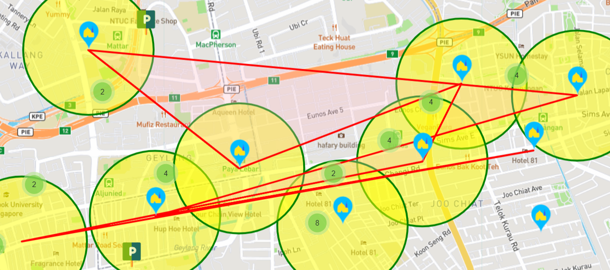
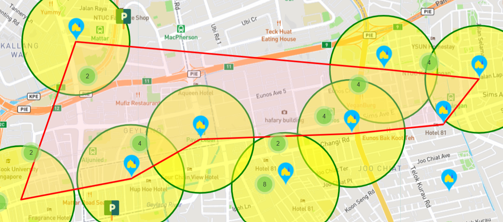
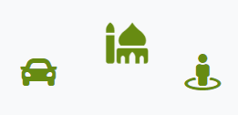
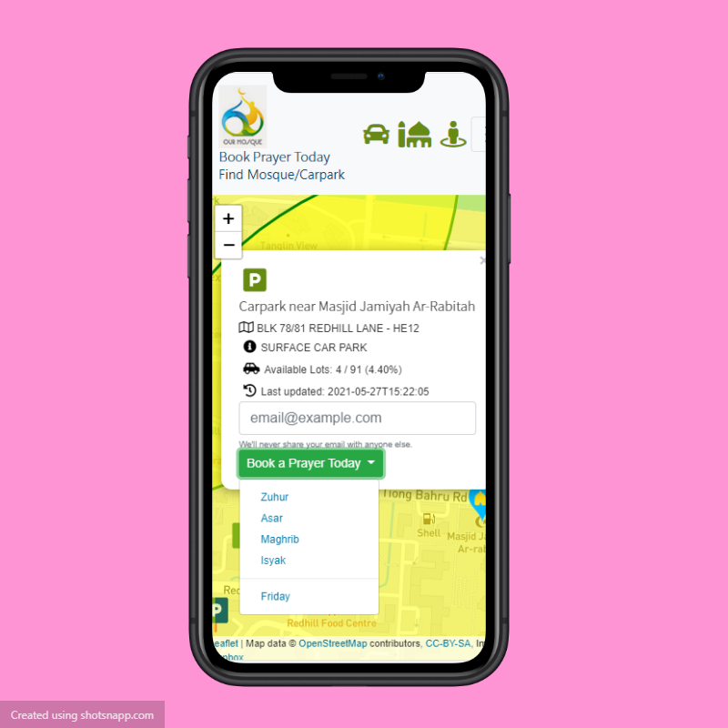

# Mosque Prayer Booking Web App
:warning: **IMPORTANT**: This app is for demonstration and educational purpose only. DO NOT use this web app for actual booking of mosque prayer slots. Please go to [www.muis.gov.sg]('http://www.muis.gov.sg') for details on prayer bookings of mosques in Singapore.

**Mock up** web app for booking a prayer session at mosques in Singapore using *Leaflet* interactive map. The map also shows nearby ***HDB car parks** with **live-updates of available lots*** - specially for congregant drivers who needs to find HDB parking lots around the mosque area since the mosques have very limited/none parking areas.

URL: https://mosque-prayer-booking.netlify.app/

## Technology use
1. HTML/CSS - Mobile responsive design, animation
2. Javascript, DOM elements
3. LeafletJS map with custom markers (SVG icons)
3. Bootstrap, Flexbox
4. JSON, CSV data - AXIOS, async/await
5. Geo coordinates using Singapore SVY21 format
6. Fontawesome, Google Fonts

## Business Use Case
After Singapore’s circuit-breaker in Mar 2020, mosques in Singapore are gradually opening up for Muslims to pray at the mosques.  Since Dec 2020, the **Majlis Ugama Islam Singapura (or Muis)** announced mosques may re-open with limited congregants for the weekly Friday prayers. Now, most mosques offer other daily prayer sessions (Zuhur, Asar, etc).  However, there is no more walk-ins allowed and congregants need to book a prayer slot before visiting the mosques.

Congregants who drive also face difficulty to find available parking lots as most mosques do not provide or have limited parking spaces.  This creates traffic congestion with illegal parkings of nearby roads. This happens usually during the weekly Friday prayers, which is obligatory for Muslim men to attend the sermons and perform their prayers at the mosques at around 1pm to 2pm.

To manage crowd control, the app only allows booking for today only.

## Objectives
To create a *mobile-responsive* web app to:
1. Book a prayer slot at a mosque for today
2. Allow users to find a nearby car park to the mosque
3. Show availability of parking lots at the selected car park
4. Search mosques by name, district, postal code or street name 
5. Allow user to locate his/her current location
6. Show today's Singapore prayer times 

## Owner and Users
The users of this web app are **local mosque congregants**:
* find their destination mosque to book a prayer for today
* if they drive, finding the nearest available carpark before reaching the mosque

The site owner is Majlis Ugama Islam Singapura (Muis) as the authority, under the Administrative Muslim Law Act in Singapore, that administers all local mosques.  This includes setting policies or guidelines of determining the prayer slots at mosques during prayer sessions.

# UI Design and Process Flow
Below shows the initial UI design prior to app development:

Date selection was not implemented to avoid step 2 and go directly to the booking page. This achieve the 3-step action to **allow only current date booking**.

# Data Sources
The app requires data extracted from public domains:
* [Muis.gov.sg](http://www.muis.gov.sg) 
    * Mosque Directory (Web HTML to CSV)
    * Prayer Times for year 2021 (PDF to CSV)
    * [OurMasjid.sg](http://ourmasjid.sg) and [Muslim.sg](http://muslim.sg) - community portals to show presentation of information from Muis
* [Data.gov.sg](http://www.data.gov.sg)
    * HDB Carpark Information (CSV)
    * HDB Carpark Availability (JSON API)
* [OneMap.gov.sg API](https://www.onemap.gov.sg/docs/)
    * Getting (x,y) and (lat,lng) coordinates from address/postal codes of mosques 
    * Getting (lat,lng) coordinates from carparks which has (x,y) format in Singapore SVY21 map system
* [URA.gov.sg](http://www.ura.gov.sg)
    * [Districts](https://www.ura.gov.sg/realEstateIIWeb/resources/misc/list_of_postal_districts.htm) from sector code

To improve efficiency, mosques and carpark geo data were extracted from OneMap separately and reuse as complete JSON files in the app.

[lat,lng] Distance function is based on https://www.geodatasource.com.

## Potential Data Sources
The **URA** also provides API on the availability of lots in their managed carparks in Singapore.  Other data sources on carpark availability can be added into the app.

The Prayer times in this project is only for 2021 year.  Each year end, Muis uploads the following year's prayer times.  This has to be uploaded into the web app as part of the annual configuration.

Mosques available prayer slots can be added into the app similar to carpark availability format. 

### Note: 
> As of this update (May 2021) There is no public API to access the available prayer slots at the mosques.

# Data Structure
Data are extracted, transformed and loaded to the following structure as Objects/Arrays:

## 1. Mosque Object
* Name
* Address
* Postal Code
* Mainline Number
* Geo location:
    - (x,y) coordinates in SVY21 Singapore format
    - (lat,lng) coordinates
* District:
    - General location
    - District Code
    - Sector Code - first 2 digit of Postal Code
    - Sectoral Codes (list of sector codes in District)
* Array of nearby Carparks objects (_n_ km radius)

## 2. Carpark Object
* Carpark Number/Code (_defined by HDB_)
* Address
* Carpark Type (Multi-storey, surface, etc)
* Geo location:
    - (x,y) coordinates in SVY21 Singapore format
    - (lat,lng) coordinates
* Lots Information:
    - Lot type ('C' for cars only)
    - Total lots
    - Available lots
    - Last updated date/time stamp

## 3. Prayer Times
* Date
* Day
* Array of Sessions:
    - Session Name (Zuhur, Asar, etc)
    - Time

# Feature: Search Mosque
The search feature is only used to locate a specific mosques or an area of mosques and can highlight the nearby carparks within set radius (in KM).

The search parametes are:
* By *Mosque Name*
* By *Mosque or Carpark Address* (e.g. Partial Street Name)
* By *Mosque Postal Code*
* By *Mosque Sector Code*
* By *General District Location*

1. Retrieve search string and pass as parameter to **getLocation()** method

2. **Priority One: Each Mosque**
    1. Exact Match of Postal Code
    2. Exact Match of Sector Code
    3. Exact or Partial Match of Name
    4. Exact or Partial Match of Address
    5. Exact or Partial Match of General District Location

3. **Priority Two: Each Mosque's Nearby Carpark**
    1. Exact or Partial Match of Carpark's Address
    2. If found on first carpark, exit iteration and move to next mosque to compare

4. Returns the following result:
    1. A list of mosques (lat,lng) coordinates that matches the above criteria to form a **polygon** area on map
    2. If only 2 mosques (lat,lng) coordinates match, then form a **polyline** on the map
    3. If only 1 mosque found, then form a **circle** of radius 0.6 km on the map
    4. If no mosque found, returns an alert message.

## Observation: Criss-cross polygons

We noticed the polygon expects a certain order of the (lat,lng) coordinates.  Otherwise, it will provide a criss-cross drawing which does not resemble a polygon shape.

### Sorting (lat,lng) coordinates for drawing polygon on map:
>A simple workaround to _minimise this occurence_ is to sort the coordinates.  A **bubble-sort algorithm** is used to arrange the coordinates before returning the resulting (lat,lng) array. See below polygon after sorted.  However, still unsure if it is best to sort by latitude or longitude.

# Animation - Squash and Stretch
Use of simple method of squash and stretch to create a more realistic **bouncing of the navbar icons**.  This means when image is stretch or squash, it must maintain the same volume of scaling. 

Function cubic-bezier() is used in the animation timing to adjust the sequence for a more life-like easing in and out.

# Website
Currently, the website is published using *Netlify* and connected to this *GitHub* repository:

https://mosque-prayer-booking.netlify.app/

## Mobile Responsive
Sample screenshot from mobile phone to book a prayer based on a carpark which is near a mosque and have available parking lots.

# Credits
Use of logos from Muis, MuslimSG and OurMasjid.sg is subject to rights from Muis.gov.sg.

For support of the mosques in Singapore during the pandemic, please go to [OurMasjid.sg](http://www.ourmasjid.sg) to donate.

## Developer
Name: Haryati Hassan

GitHub: haryati75

Email: <haryati75@gmail.com>

School: Trent Global College, Singapore

> **Purpose**: This is a school project under Trent Global College, Singapore.  The use of third-party libraries, software are for demonstration and educational purpose only.

Submission of project: 31 May 2021

Please contact the developer or school for any enquiries on the project.

